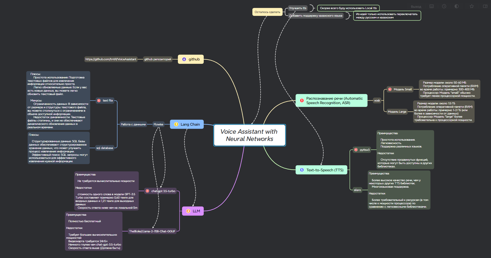

# VoiceAssistant


VoiceAssistant is a project that combines Flowise and Chat GPT to create a powerful voice-driven assistant.


*Mind Map for the Voice Assistant*

## Table of Contents

- [Installation](#installation)
- [Usage](#usage)
- [Contributing](#contributing)

## Installation

1. **Clone the repository:**

    ```bash
    git clone https://github.com/trr69/Voice-Assistant-For-BOKEY-LIBRARY.git
    ```

2. **Install dependencies:**

    ```bash
    pip install -r requirements.txt
    ```

3. **Set up Flowise:**

    Follow the instructions in the [Flowise repository](https://github.com/FlowiseAI/Flowise) for installation and configuration.

4. **Import RAG_01 model into Flowise:**

    Use the Flowise local web interface to import the `chatflow.json` file.

5. **Get API_URL from Flowise:**

    Copy the `API_URL` from the local Flowise web interface.

6. **Insert API_URL into config.py:**

    Open the `ask_gpt.py` file and paste the copied `API_URL` at the designated location.

7. **Get Chat GPT API key and insert it into Flowise Connectr Credential:**

    Obtain an API key for Chat GPT and insert it into the Flowise Connectr Credential settings.

8. **Download Vosk model:**

    Download a small Vosk model from [here](https://alphacephei.com/vosk/models).

9. **Insert Vosk model path into config.py:**

    Open the `config.py` file and specify the path to the downloaded Vosk model.

## Usage

Run the VoiceAssistant application and interact with it using voice commands.

```bash
python main.py
```


## Contributing
